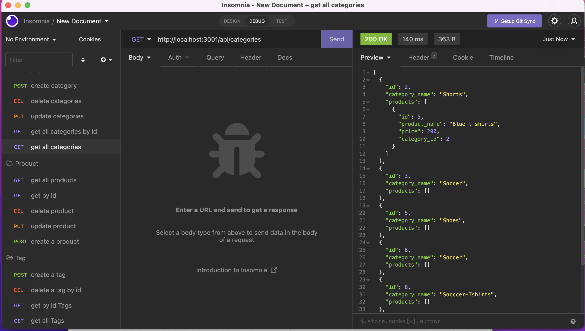

# ecommerce-backend
  

   

  ## Description
  This project was to create tables using Models and sequelize. Then, I created api routes for each to grab each model. I also created association links between the products and categories, and referenced them in their respective models and routes.

   

  ## Youtube Link:
  https://www.youtube.com/watch?v=0iIhVx3_t0c

  ## Table of Contents
  * [Installation](#installation)
  * [Usage](#usage)
  * [License](#license)
  * [Contributing](#contributing)
  * [Questions](#questions)

  ## installation
  must do npm i express sequelize, dotenv. Then do node seed to populate the data from the starter code given.

  
  ## License 
  This project is license under MIT

  ## Contributing
  the user contributes by running tests through insomnia.

  ## Tests
  npm start to start to test the api routes. 

  ## Questions
  If you have any questions about this repository, please contact me via kalaitzidispaul@gmail.com. You can view more of my projects at https://github.com/paulkalait
  